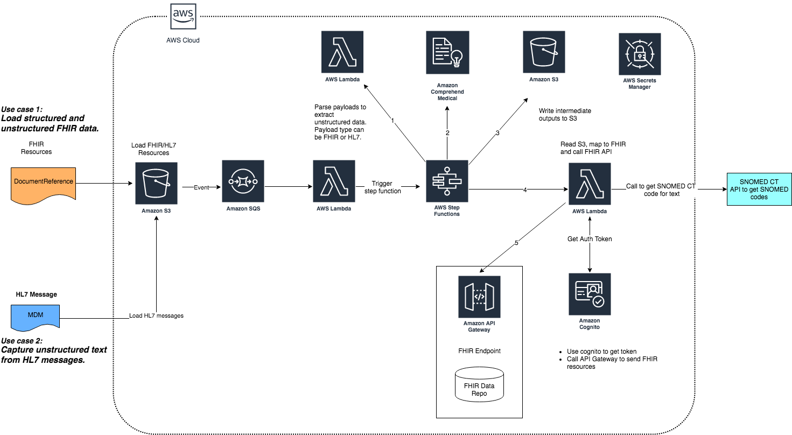
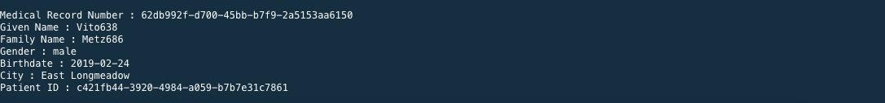
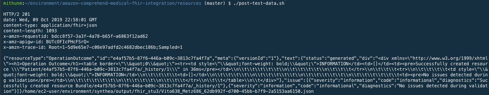
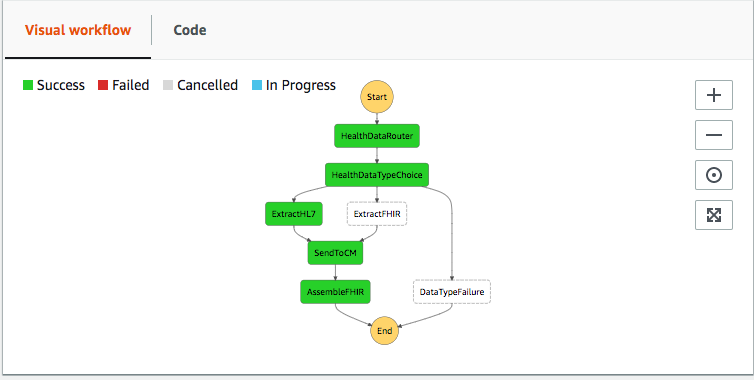

## Lab -2 - Integrate Comprehend Medical

This section of the lab will focus on integrating Comprehend Medical with the FHIR interface.


## Architecture & Use cases



1. Run the following command to go back to the environment directory.

    ```
    cd ~/environment/
    ```

1. Run the following command to download code for FHIR Comprehend Medical integration. The git credentials to use are as below:

    ```
    git clone https://github.com/aws-samples/amazon-comprehend-medical-fhir-integration.git
    ```

## Load data to FHIR repository

We will now load a patient record to an existing FHIR repository. The test file used here was generated using Synthea. Synthea is a synthetic patient generator that models the medical history of synthetic patients. It is widely used in the healthcare industry to output high-quality synthetic, realistic but not real, patient data and associated health records covering every aspect of healthcare. More details about Synthea can be found [here](https://github.com/synthetichealth/synthea/wiki).

1. Go to test-data folder by running following command.
    ```
    cd amazon-comprehend-medical-fhir-integration/test-data/master-patient-data/
    ```
## Extract key patient info 

1. Run the following command to extract the required info for the workshop.
    ```
    python ~/environment/amazon-comprehend-medical-fhir-integration/resources/extract-patient-info.py \
        ~/environment/amazon-comprehend-medical-fhir-integration/test-data/master-patient-data/patient-bundle.json
    ```

The output would be similar to the screenshot below. **Copy the output in a notepad to use in later step.**


1. Go to **resources** folder under **amazon-comprehend-medical-fhir-integration** from the left navigation pane.


1. Open the file post-test-data.sh in the editor under resources.Enable wrap lines from the “View” menu option to have a better view. 

**Replace the API_END_POINT with the value generated in Part 1 of the workshop. Also replace the ID TOKEN with the copied and saved token value from Part 1 of the workshop.**

**Save the updated file post-test-data.sh (File→Save menu item) before running the next step.**

1. Change the terminal directory by running following command:

    ```
    cd ~/environment/amazon-comprehend-medical-fhir-integration/resources/
    ```

1. Run the following commands to set the executable permissions and then execute the script to load the master patient record in the FHIR repository.

    ```
    chmod u+x post-test-data.sh
    ./post-test-data.sh
    ```

The output should be similar to below:


1. Validate the data by running following command to retrieve a patient’s data. Patient ID was received from the extract info script. Click [here](#extract-key-patient-info) to extract patient info again.

    ```
    curl -H "Accept: application/fhir+json" \
    -H "Authorization:<<ID Token>>" <<API_END_POINT>>Patient/<<PATIENT_ID>> | jq
    ```

1. Get the conditions for the patient by running the following command

    ```
    curl -H "Accept: application/fhir+json" \
    -H "Authorization:<<ID Token>>" <<API_END_POINT>>Condition?patient-ref-id=<<PATIENT_ID>> | jq
    ```


**Make a note of the number of conditions for the patient. We will be adding additional conditions extracted from the clinical notes. It is possible that there were no conditions loaded previously.**

## Building  amazon-comprehend-medical-fhir-integration project 

1. Run the following from terminal to switch to the comprehend medical directory:

    ```
    cd /home/ec2-user/environment/amazon-comprehend-medical-fhir-integration/
    ```

1. Next, build the project by running the following mavan command. 

    ```
    mvn clean install
    ```

The build process will create a single jar file. It has different classes that are deployed as lambda functions to process hl7 and FHIR resource files, call comprehend medical api's and make API calls to an existing FHIR repository.


## Deploy the project code ##

We will now deploy the workshop code using a SAM(Serverless Access Model) template. More details about SAM can be found [here](https://docs.aws.amazon.com/serverless-application-model/index.html).

1. Go to **resources** folder under amazon-comprehend-medical-fhir-integration.  Change directory to resources folder.
    cd ~/environment/amazon-comprehend-medical-fhir-integration/resources
1. Run the following command to package the code and other artifacts. Use the same bucket name from part-1 of the lab.

    ```
    aws cloudformation package --template-file FHIR-CM-Integration.yaml \
    --output-template-file serverless-output.yaml \
    --s3-bucket <<FHIR_CODE_BUCKET>>
    ```

1. Run the following command to deploy the SAM template. Specify a secret name for your Secrets Manager.

    ```
    aws cloudformation deploy --template-file /home/ec2-user/environment/amazon-comprehend-medical-fhir-integration/resources/serverless-output.yaml \
    --stack-name fhir-cm-integ \
    --capabilities CAPABILITY_IAM \
    --parameter-overrides CognitoSecretName=<<REPLACE_SECRET_NAME>> \
    FHIRAPIEndpoint=<<API_END_POINT>> ClientId=<<CLIENT_ID>>
    ```

1. Get DATA_INPUT_BUCKET by running the following command.  Save this value for use by later steps.

    ```
    aws cloudformation describe-stacks \
        --stack-name fhir-cm-integ \
        --query 'Stacks[].Outputs[?OutputKey==`BucketName`][OutputValue]' \
        --output text
    ```

## HL7 Message Flow

In this part of the lab, we will upload a HL7 file which has OBX segment containing clinical notes. The deployed project would extract the notes from the HL7 message, lookup the patient from FHIR repository and enrich the record with the medical conditions extracted from the clinical notes in HL7. Typically customers need to build some manual workflows or custom rule engines to extract the clinical entities from such segments. In this use case, we have automated the pipeline by ingesting the HL7 messages to S3 and integrating it with Amazon Comprehend Medical using AWS step functions.

1. Go to the resources/test-data folder under FHIR-CM-Integration by running following command from terminal.

    ```
    cd ~/environment/amazon-comprehend-medical-fhir-integration/test-data
    ```

1. Open the mdm.txt file under test-data directory. It is populated based on test data that was used as part of this lab. It represents the HL7 message for the same patient loaded in FHIR repository.

1. Upload the file to s3 folder using the command below. It would trigger the flow to extract the data from OBX segments, run it through Comprehend Medical, extract the Condition resources and enrich data in FHIR repository.  Use the DATA_INPUT_BUCKET name retrieved from step 10.

    ```
    aws s3 cp mdm.txt s3://<<DATA_INPUT_BUCKET>>/input/hl7/mdm.txt
    ```


The above command should trigger the step functions. You can monitor the progress of the step functions by login to the console and going to the step functions service. Click on the step function that is deployed as part of the workshop. It would show the progress of the various steps.

1. Run the below command again to lookup the conditions for the patient:

    ```
    curl -H "Accept: application/fhir+json" -H "Authorization:<<ID Token>>" <<API_END_POINT>>Condition?patient-ref-id=<<PATIENT_ID>> | jq
    ```

    **Note: In case your ID token is expired, run the below command to get a new auth token by running the below.You can then use it in the curl request to get the Conditions.**

    ```
    python ~/environment/amazon-comprehend-medical-fhir-integration/resources/init-auth.py <<CLIENT_ID>>
    ```

    Look for the conditions again. It should show the additional conditions that were extracted from the hl7 message. This completes the second part of the lab.

## Optional - FHIR Message flow

1. Run the following command to change directory to resources directory.

    ```
    cd /home/ec2-user/environment/amazon-comprehend-medical-fhir-integration/test-data/
    ```

1. Look for the file FHIR-DocRef.json and open it in the editor.
1. Edit the file and look for the tag *REPLACE_WITH_PATIENT_ID*
1. Replace it with the patient id used in scenario 1. The purpose is to extract condition resources from clinical notes embedded in the data tag of the resource and load it as Condition resources for the patient.
1. Run the following command to upload the file to trigger the workflow:

    ```
    aws s3 cp test-data/FHIR-DocRef.json s3://<<DATA_INPUT_BUKCET>>/input/fhir/FHIR-DocRef.json
    ```

1. Check the step functions console to monitor the progress of the work flow.
1. Once the step functions is completed, run the following command to get the Conditions for the patient. It should now be updated with the new conditions that were loaded.
    ```
    curl -H "Accept: application/fhir+json" -H "Authorization:<<ID Token>>" <<API_END_POINT>>Condition?patient-ref-id=<<PATIENT_ID>> | jq
    ```
It should now show the additional Conditions that were loaded from the notes in the DocumentReference resource.


 

## Cleanup 

Once you have completed the workshop, simply go to the cloudformation console, select the two templates that were deployed as part of the workshop and click on delete. It will delete all the resources (except S3 buckets) that were created as part of the workshop.

You can delete the S3 buckets manually by going to the S3 console, selecting the bucket names and click on delete. It will ask you to confirm by entering the name of the bucket.
